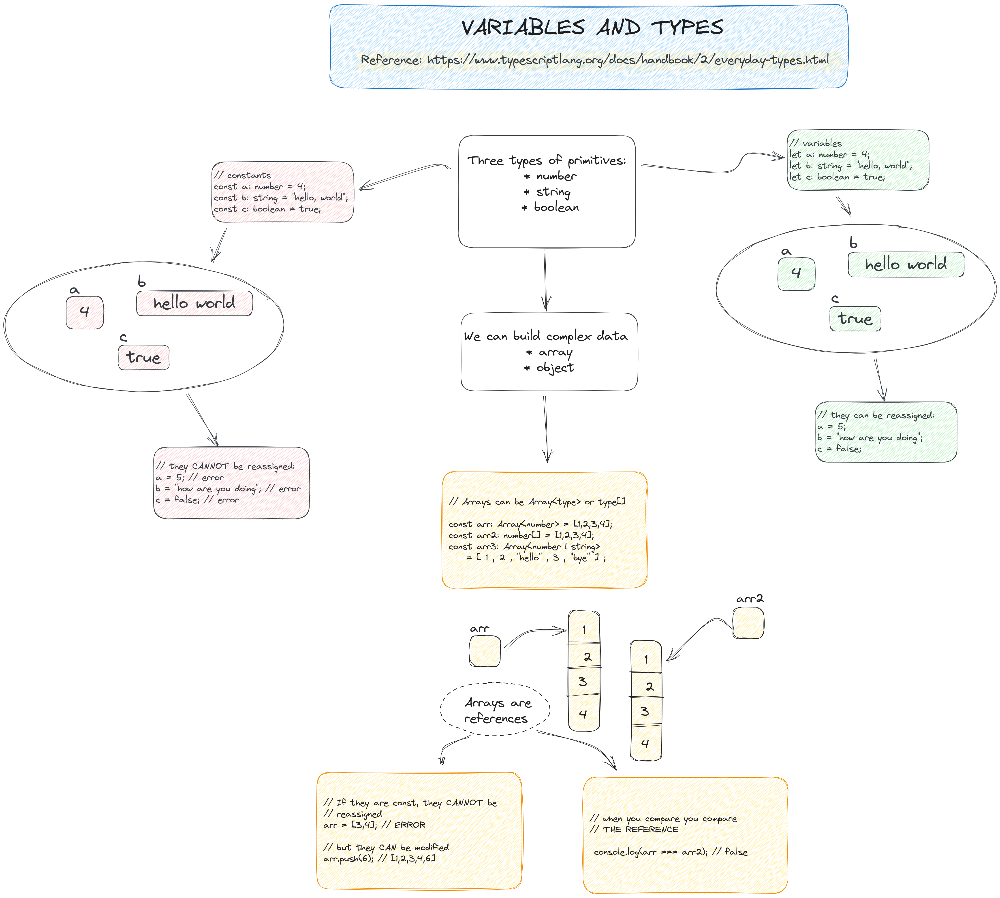

# 1. TEORÍA

<figure><figcaption></figcaption></figure>

#### Teoría Básica: TypeScript

**Comportamiento de los Valores en JavaScript**

Cada valor en JavaScript tiene comportamientos específicos observables mediante diferentes operaciones. Por ejemplo, si tenemos una variable `message`:

```javascript
const message = "Hello World!";
message.toLowerCase(); // "hello world!"
message(); // TypeError: message is not a function
```

El entorno de ejecución determina el tipo del valor y sus comportamientos. JavaScript usa tipado dinámico, lo que puede llevar a errores difíciles de prever antes de la ejecución.

**Introducción al Tipado Estático**

TypeScript agrega tipado estático a JavaScript, permitiendo detectar errores antes de ejecutar el código.

**Ejemplo:**

```typescript
const message: string = "hello!";
message(); // Error: Esta expresión no es callable. Tipo 'String' no tiene firmas de llamada.
```

**Manejo de Fallos No Excepcionales**

JavaScript no siempre arroja errores al encontrar problemas, como al acceder a propiedades inexistentes:

```javascript
const user = { name: "Daniel", age: 26 };
user.location; // undefined
```

TypeScript marcará esto como error:

```typescript
const user = { name: "Daniel", age: 26 };
user.location; // Error: La propiedad 'location' no existe en el tipo '{ name: string; age: number; }'.
```

**Beneficios del Tipado Estático**

TypeScript ayuda a prevenir errores  como:

*   **Errores tipográficos**:

    ```typescript
    const announcement = "Hello World!";
    announcement.toLocaleLowercase(); // Error: Propiedad 'toLocaleLowercase' no existe en el tipo 'String'
    ```
*   **Funciones no llamadas**:

    ```typescript
    function flipCoin() {
      return Math.random < 0.5; // Error: El operador '<' no se puede aplicar a tipos '() => number' y 'number'
    }
    ```
*   **Errores lógicos básicos**:

    ```typescript
    const value = Math.random() < 0.5 ? "a" : "b";
    if (value !== "a") {
      // ...
    } else if (value === "b") {
      // Error: Comparación inalcanzable porque los tipos '"a"' y '"b"' no tienen superposición.
    }
    ```

**Tipos para Herramientas de Desarrollo**

TypeScript mejora la experiencia de desarrollo al proporcionar sugerencias de código y completaciones automáticas basadas en los tipos de las variables.

```typescript
import { Application } from "https://deno.land/x/oak/mod.ts";
const app = new Application();

app.use((ctx) => {
  ctx.response.body = "Hello Deno!";
});

await app.listen({ port: 8000 });
```

**El Compilador de TypeScript: `tsc`**

El compilador de TypeScript (`tsc`) convierte el código TypeScript en JavaScript ejecutable.

```typescript
// hello.ts
console.log("Hello world!");
```

Compila con `tsc hello.ts`, generando `hello.js`:

```javascript
// hello.js
console.log("Hello world!");
```

Si introduces un error de tipo:

```typescript
function greet(person: string, date: Date) {
  console.log(`Hello ${person}, today is ${date.toDateString()}!`);
}

greet("Brendan"); // Error: Se esperaban 2 argumentos, pero se obtuvieron 1.
```

`tsc` detectará el error antes de la ejecución.

**Tipos Explícitos**

Podemos definir tipos explícitos para variables y funciones:

```typescript
function greet(person: string, date: Date) {
  console.log(`Hello ${person}, today is ${date.toDateString()}!`);
}

greet("Maddison", new Date());
```

TypeScript también puede inferir tipos automáticamente en muchos casos.

**Configuración de Estricta**

TypeScript ofrece configuraciones de estricta (`strict`) que mejoran la detección de errores y la robustez del código, como `noImplicitAny` y `strictNullChecks`.

```typescript
// Configuración estricta en tsconfig.json
{
  "compilerOptions": {
    "strict": true
  }
}
```

Estas configuraciones hacen de TypeScript una herramienta poderosa para escribir código seguro y mantenible, ayudando a detectar y prevenir errores antes de la ejecución.
